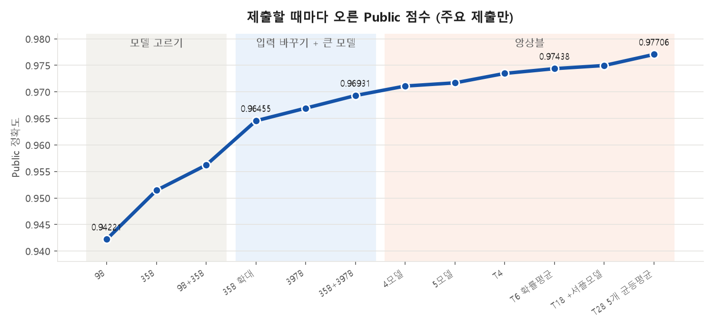
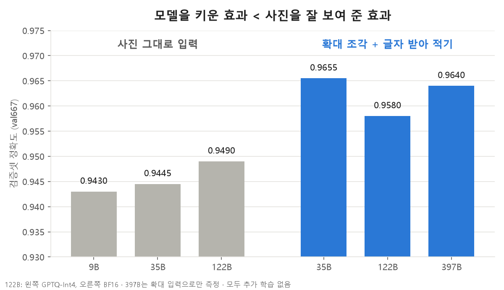
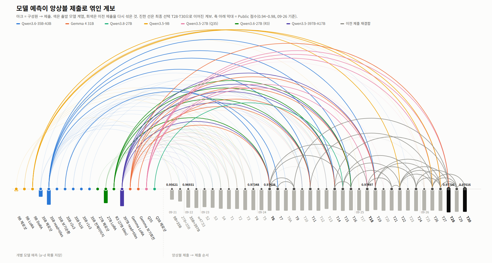

# 01 · SSAFY AI 챌린지 — 사진 속 글자 읽기 VQA

> SSAFY 16기 · 2차 2026.09.21 – 09.28 · 1차 2026.08.28 – 08.31 · 5인 팀
> 역할: 실험 설계 · 채점표 · 학습 · 앙상블 · 제출 · 팀 저장소 커밋 약 452건 중 약 354건(78%)
> 공개 저장소: 1차 [ssafy16-ai-challenge-1](https://github.com/Jkim1647/ssafy16-ai-challenge-1) · 2차 [ssafy16-ai-challenge-2](https://github.com/Jkim1647/ssafy16-ai-challenge-2)

## 결과

| 회차 | 과제 | 결과 |
|---|---|---|
| 2차 | 사진 속 간판·메뉴·표지판 글자 읽기 4지선다 VQA | **최종 2위 / 217팀** (Private 0.98093) · Public 11위(0.97706)에서 9계단 상승 · 제출 54회 · 모델 8종(9B~397B) |
| 1차 | 재활용품 이미지 4지선다 VQA | Private 18위 / 954팀 (상위 약 1.9%) |

train 6,714 · dev 2,683 · test 6,714문제. 외부 AI API로 답을 받는 것은 금지 → 오픈 VLM을 직접 추론.



## 핵심 — 모델을 키우는 대신 입력을 바꿨다



| 설정 | val667 정확도 |
|---|---:|
| 9B · 원본 | 0.943 |
| 35B · 원본 | 0.9445 |
| 122B · 원본 | 0.949 |
| **35B · 4분할 확대 + 글자 받아 적기** | **0.9655** |

## 샘플 문제

같은 35B 모델에서 검증셋 667문제 중 **17문제**가 "원본만 볼 때 틀림 → 확대 + 받아 적기로 맞음"으로 바뀌었습니다. 예: PC방 모니터 속 요금표처럼 사진 안에서 아주 작게 찍힌 가격을, 확대 조각에서 `00:30 1,000원`으로 받아 적은 뒤 정답을 고르는 식입니다. (대회 데이터라 원본 사진은 공개하지 않습니다.)

## 파이프라인

```
원본 사진 (EXIF 회전 보정)
 → 4분할 × 2배 확대 조각
 → VLM 8종이 관련 글자를 먼저 받아 적고 정답 선택
 → a·b·c·d 확률만 저장 (형식 오류 0, GPU 없이 조합 재계산)
 → 채택 게이트: train 제로샷 점수 상승 AND 자체 채점표 H408 v2(401문제) 비하락
 → 확률 평균 앙상블 → 제출
```
GPU: Colab Pro+(RTX PRO 6000) · RunPod(H200) · Nebius(H100×8, 397B용)



## 트러블슈팅

### 1. 모델을 3배 키워도 점수가 거의 오르지 않음
- **원인 분석** 오답을 모아 분류 → 1위 원인은 "글자가 작아서 못 읽음"
- **대안** 더 큰 모델(397B) · 초해상도 복원 · **사진 확대 조각 + 받아 적기 프롬프트**
- **선택 이유** 초해상도는 흐린 "8"을 선명한 "3"으로 바꾸는 잘못된 복원 위험이 있어 배제. 원본 픽셀만 쓰는 4분할 2배 확대 선택
- **결과** 같은 35B, 추가 학습 없이 0.9445 → 0.9655 (+2.1%p) — 3배 큰 122B보다 높음

### 2. Public 점수를 믿을 수 없었다 (1차의 교훈)
- **문제** 1차에서 Public 점수로 제출물을 고르다 Public 12위 → Private 18위 (리더보드 과적합)
- **해결** SHA-256 + perceptual hash로 중복 사진 45묶음, 결함 문제 71개 제거 · 팀원들과 dev 350문제를 사진과 대조하고 질문 179개 재작성 → 401문제 채점표(H408 v2)
- **잡음 기준** 두 제출의 답이 K개 다르면 우연만으로 ±√(K/2)문제 차이가 날 수 있음 → 그보다 작은 Public 차이는 개선으로 치지 않음 (Public 1문제 ≈ 0.0003)

### 3. "어려운 문제"의 절반은 문제 자체 오류
- 모든 모델이 틀리는 139문제를 직접 검수 → 절반은 문제 오류, 23%는 사람도 판단 불가
- 휴대폰 사진의 EXIF 회전 정보가 무시돼 누운 채 입력되던 버그 수정
- 전원 오답 문제 33개 → 5개

## 기술 선택 이유

| 선택 | 이유 |
|---|---|
| "다르게 틀리는" 모델 앙상블 | 잘하는 모델을 더하는 것보다 틀리는 문제가 다른 모델(Gemma 4 등)을 섞을 때 오답이 상쇄 |
| a~d 확률만 저장 | 자유 응답의 형식 오류 제거, GPU 없이 모델 16개·제출 32개 조합 재계산 |
| 단순 확률 평균 | 결합법 8가지를 비교했지만 가중치를 맞출수록 채점표에 과적합 |
| AI 보조 코딩 | Codex·Claude로 추론·앙상블 코드 작성, 규칙은 AGENTS.md·CLAUDE.md로 관리. 채택 여부는 두 채점표로 직접 판단 |

## 회고
- **잘한 점** 점수가 막혔을 때 모델을 바꾸기 전에 오답을 먼저 분류했고, 1차의 과적합 경험을 2차의 채택 규칙으로 바꿨다
- **아쉬운 점** 마지막 날엔 결국 Public 점수로 최종 제출(T28·T30)을 골랐는데 자체 채점표로는 T6이 4문제 더 좋았다. "엄밀한 정답"으로 라벨을 고쳤더니 다수 합의 기준과 멀어졌다(일치율 81% → 43~48%). 유료 GPU 운영 실수로 약 $14 낭비
- **다음에는** 최종 제출 선택 규칙을 대회 시작 전에 문서로 고정하고, GPU 인스턴스 종료를 자동화한다
