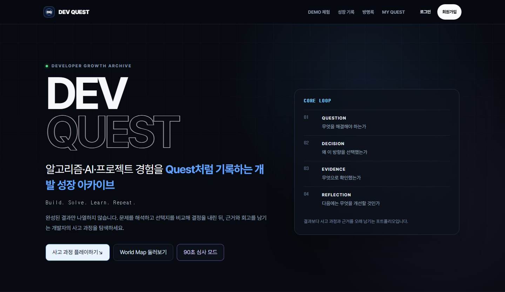
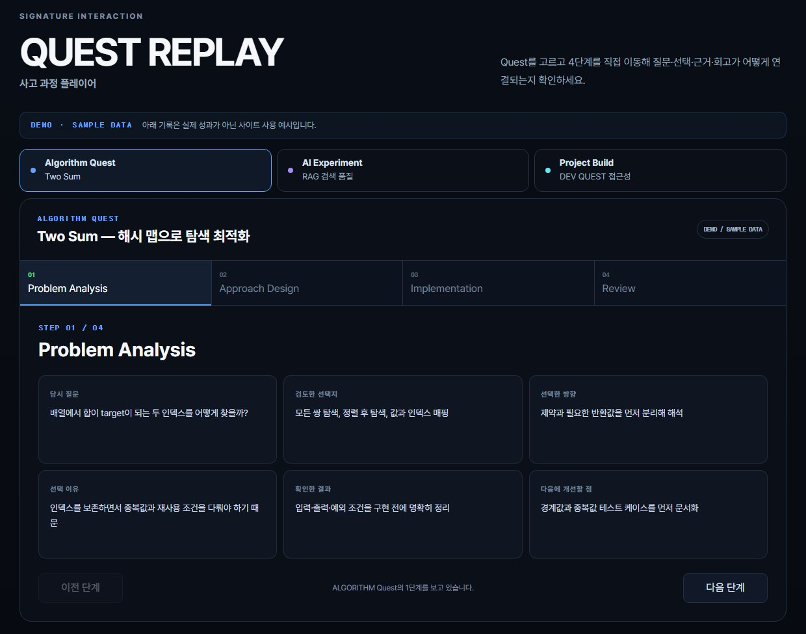
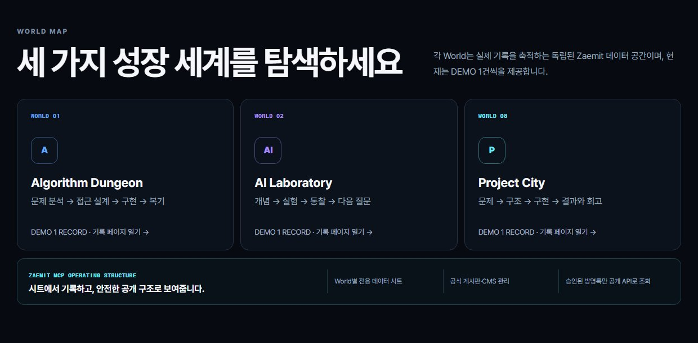

# 02 · DEV QUEST — 개발 성장 기록 사이트 `VIBE CODING`

> 재밋 MCP 웹사이트 챌린지 · **재밋특별상** (2026-09-29 발표) · 전국 공개 공모전 · 1인 출품
> 제작 2026.08.20 – 08.21 · 사이트: https://wv1787202495138203.zaemit.ai/ · 저장소: [Jkim1647/dev-quest](https://github.com/Jkim1647/dev-quest)



## 한 줄 요약

알고리즘 공부를 노션에 정리해 오다가, 풀이 결과뿐 아니라 **주제를 정하고 개발해 가는 과정까지 기록하는 공간**을 만들고 싶어 참가했습니다. 코드를 직접 쓰지 않고 **지시·검수하는 AI(Codex)** 와 **실행하는 AI(ChatGPT + 재밋 MCP)** 에게 역할을 나눠 맡긴 바이브 코딩 프로젝트이며, 처음으로 외부 MCP를 AI에 연결해 본 경험입니다.

| Quest Replay | World Map |
|---|---|
|  |  |

## 역할 분담

```
나 ──────────────▶ Codex (지시·검수) ──지시문──▶ ChatGPT + 재밋 MCP (실행) ──▶ Zaemit 사이트
목표·우선순위 결정    지시문 설계                    사이트 생성·수정·발행            시트 · CMS · 회원
결과 확인·승인        공개 URL 기준 SEO·반응형 QA     데이터 시트·CMS·공개 API
비밀번호·제출은 직접   설정 원인 진단 · GitHub 문서화   revision 보존 · 작업 보고
                      ◀────────── 결과 보고 ──────────
```

**왜 두 AI로 나눴나** — 공모전 조건이 "재밋 MCP 실제 사용"이었는데, 재밋 커넥터가 연결 후에도 Codex 작업의 도구 목록에 나타나지 않았습니다. 그래서 MCP는 ChatGPT(Work 모드)에 커스텀 커넥터(`https://zaemit.ai/mcp`)로 연결해 실행을 맡기고, Codex는 지시문 설계와 공개 URL 점검을 맡겼습니다.

## 타임라인 (Codex 작업 기록)

| 시각 | 작업 |
|---|---|
| 08-20 14:10 | ChatGPT에 재밋 MCP 연결 |
| 14:35 | 첫 발행 |
| 15:05 | 공개 URL 기준 SEO·QA 점검 — `noindex,nofollow`로 검색 노출이 막힌 것 발견 |
| 17:05 | GitHub 문서 저장소 |
| 08-21 10:00 | 디자인·반응형 고도화 |
| 13:15 → 13:44 | "더 창의적인 것" 요청 → Quest Replay · 90초 심사 모드 채택 |
| 14:26 | MY QUEST (회원별 격리) |
| 14:30 | 인증 메일 미발송 해결 |
| 15:41 | 최종 제출 |

## 프롬프트 — 이렇게 지시했습니다

### 1. 기획안으로 목표·제약·금지·순서를 먼저 고정 (Codex에게, 18개 절 기획서)
```text
Zaemit의 MCP 기능을 적극적으로 활용하여, 실제로 배포하고 공모전에 제출할 수 있는
개인 개발 성장 기록 웹사이트를 제작해줘.
# 17. 중요한 구현 원칙
Zaemit MCP에서 지원하는 정확한 tool 이름과 parameter는 실제 schema를 확인해서 사용한다.
추측해서 존재하지 않는 tool 이름을 사용하지 마라.
# 18. 작업 방식
한 번에 모든 것을 무작정 생성하지 말고 다음 순서로 작업한다.
STEP 1 현재 환경과 연결된 MCP 확인 …
```
사이트 컨셉 · 디자인 시스템 · 페이지별 구성 · SEO까지 적은 기획서를 먼저 주고, 없는 도구를 지어내지 말 것과 단계별 진행을 명시했습니다.

### 2. 실행 AI에게 보낼 지시문을 검수 AI가 쓰게 함
```text
나 → Codex:  다음으로 chatgpt에 명령내려야 하는 프롬포트 작성해줘

Codex가 만든 지시문 → ChatGPT:
Zaemit MCP를 사용하여 DEV QUEST 사이트의 운영 필수 설정과 공모전 제출 전 QA를 진행해줘.
- 기존 디자인, 콘텐츠, 페이지 구조, Guestbook 기능은 유지한다.
- 존재하지 않는 개인정보·경력·성과·학습 수치는 만들지 않는다.
```
바꾸지 말아야 할 것과 **가짜 수치 금지**를 매번 지시문에 넣었습니다.

### 3. 결과 보고를 다시 붙여 넣고 한 단계 더 요구
```text
나 → Codex (ChatGPT의 변경 보고를 붙여 넣으며):
작업이 됐는데, 이걸로 공모전 1등할 수 있을까? 더 창의성있는게 필요해.
→ Codex 제안: 사고 과정 플레이어(Quest Replay) · 90초 심사 모드 → 채택
```

### 4. 문제는 현상만 알리고 진단 순서를 맡김
```text
나 → Codex:  회원가입시도하며 인증발송을 하는데 실제 내 메일로 안오는데?
→ 설정 · 발송 · 수신 단계로 나눠 읽기 전용으로 조회, 비밀번호 값은 조회·표시하지 않음
```

## 트러블슈팅 — 시연 직전 인증 메일 미발송
- **원인** 이메일 인증은 켜져 있는데 발송 메일 계정이 비어 있었음 (알림 플러그인 미설치만 보고 단정하지 않고 회원 정책까지 확인)
- **대안** 메일 앱 비밀번호를 AI 대화에 넣어 발송 계정 설정 vs **시연용으로 이메일 인증만 해제**
- **선택 이유** 비밀번호를 AI 대화에 남기지 않는 것이 우선. 비밀번호 10자 규칙과 회원별 데이터 격리는 유지
- **결과** 보안 규칙을 유지한 채 최종 제출

## 회고
- 아직 부족한 점이 많았지만, 결과를 관리 화면이 아니라 **공개 URL 기준으로 확인**하는 습관을 얻었습니다
- 데모 기록은 "SAMPLE"로 표시하고 방명록은 동의·승인한 글만 공개해, AI로 만든 결과물에도 정직성 원칙을 넣었습니다
- SSAFY에서 배운 AI 원리가 새 도구를 이해하는 데 도움이 된다는 것을 느꼈습니다. 이후 실제 풀이·실험 기록을 채워 운영할 계획입니다
