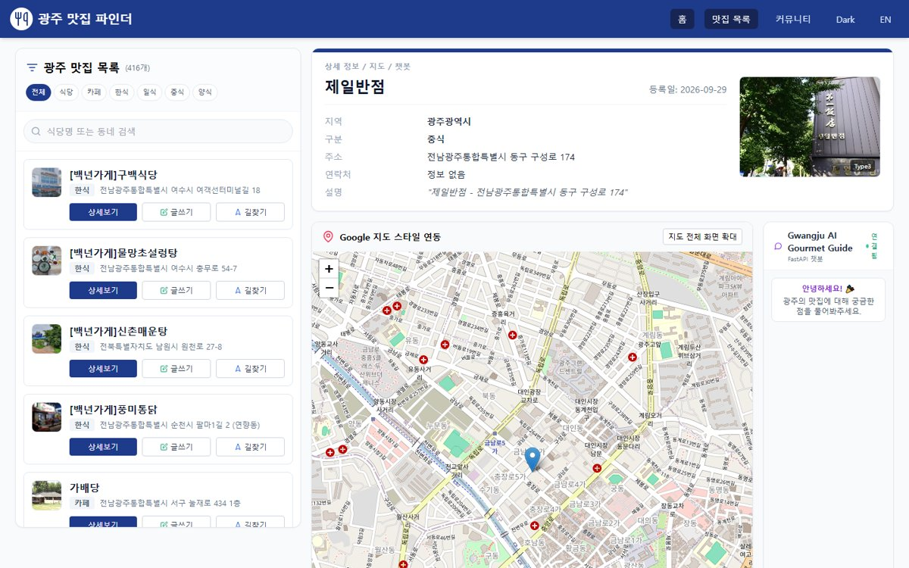
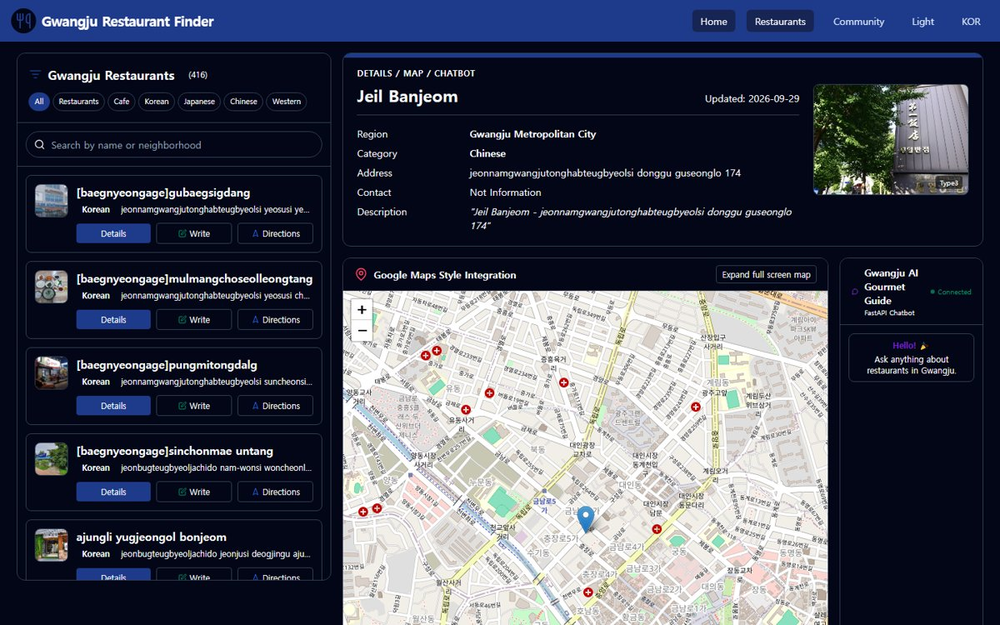
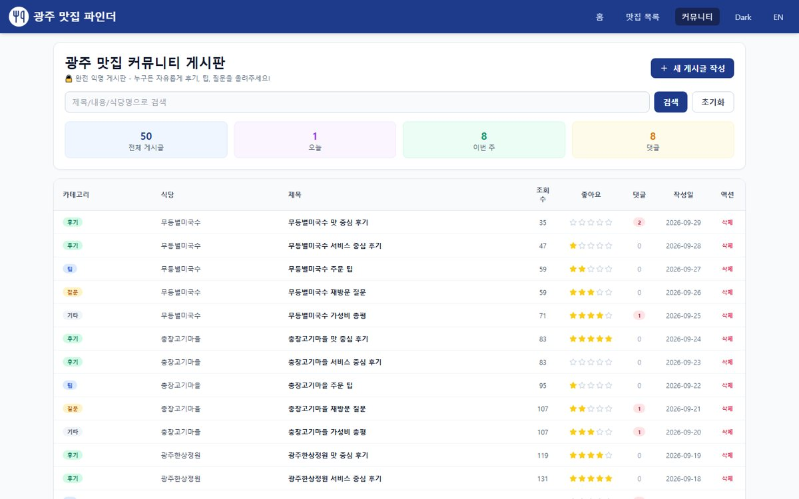

# 03 · LocalHub — 광주·전라 맛집 커뮤니티

> SSAFY 16기 스타트캠프 · 2026.07.14 – 07.16 (3일) · 3인 팀 · **팀장**
> 코드: [sc-teamproject/Frontend](https://github.com/sc-teamproject/Frontend)



## 한 줄 요약

광주·전라 맛집 **416곳을 지도에서 탐색**하고, 익명 게시판에서 후기를 나누고, **AI 챗봇에게 추천**을 받는 커뮤니티를 3일 만에 기획부터 배포까지 완성했습니다.

| 항목 | 내용 |
|---|---|
| 역할 | 팀장 — 범위 결정 · 역할 분담 · 기능명세/WBS/ERD 문서 구조 · 배포 |
| 기여 | 프론트엔드 커밋 20건 중 16건 · 다크/라이트 · 한/영 전환 · 커뮤니티 페이지네이션 · 글쓰기 UX · 백엔드 Render 배포 설정 · 카테고리 저장 버그 수정 · 데모 데이터 시드 |
| 스택 | Vue 3 · Vite · Pinia · Tailwind · Leaflet / FastAPI · SQLAlchemy · SQLite / OpenAI Chat API · 한국관광공사 TourAPI 4.0 · Google 지오코딩 / Netlify · Render |

| 다크 모드 · 영문 | 커뮤니티 |
|---|---|
|  |  |

## 구조

```
Frontend (Netlify)                Backend (Render)                 외부 API
Vue 3 · Pinia · Tailwind  ─/api─▶ FastAPI · SQLAlchemy · SQLite ─▶ TourAPI 4.0 (음식점 416곳 정제)
Leaflet 지도                      게시판 CRUD · 이미지 업로드     ─▶ OpenAI Chat API (추천 챗봇)
                                  데모 데이터 시드                ─▶ Google 지오코딩 · 장소 상세
```

## 기술 선택 이유

기본 스택은 SSAFY 스타트캠프에서 주어진 것이지만, 이 서비스에 맞는 장점이 분명했습니다.

| 기술 | 이 프로젝트에서의 장점 |
|---|---|
| **Vue 3 + Pinia** | 컴포넌트 단위 반응형 UI로 목록·상세·지도가 같은 상태를 공유. Pinia 스토어 하나에 테마·언어·선택한 맛집을 두어 화면 간 동기화가 단순 |
| **Vite** | 개발 서버가 즉시 뜨고 HMR이 빨라 3일짜리 반복 개발에 유리 |
| **Tailwind** | 다크 모드(`dark:`)와 반응형을 클래스만으로 처리해 별도 CSS 설계 없이 테마 전환 구현 |
| **Leaflet** | 가볍고 API 키가 필요 없는 오픈소스 지도. 416개 마커와 상세 연동에 충분 |
| **FastAPI** | Python이라 OpenAI SDK · 공공데이터 정제 코드를 한곳에서 처리. 타입 힌트 기반 요청 검증과 자동 Swagger 문서로 프론트와 API 계약을 빠르게 맞춤 |
| **SQLAlchemy + SQLite** | 별도 DB 서버 없이 파일 하나로 시작하고, ORM이라 나중에 PostgreSQL로 옮길 때 코드 변경이 적음 |
| **Netlify + Render** | Git 푸시만으로 자동 배포. 정적 프론트(CDN)와 API 서버를 각자 맞는 곳에 두고 무료 티어로 실제 URL 제공 |
| **TourAPI 4.0** | 공공데이터라 사용 제약이 적고 지역·업종별 음식점 정보가 정리돼 있음 |

## 트러블슈팅

### 1. 배포 후 API 호출 실패
- **문제** 로컬에서는 같은 서버처럼 동작하던 API 요청이, 프론트(Netlify)와 백엔드(Render)가 다른 도메인으로 나뉘자 실패
- **대안** 프론트 코드에 백엔드 주소 직접 적기 vs **Netlify에서 `/api`를 Render로 리다이렉트**
- **선택 이유** 로컬과 배포 모두 같은 `/api` 경로를 써서 환경마다 코드를 바꿀 필요가 없음
- **결과** 배포 URL에서 게시판·챗봇 정상 동작

### 2. 운영 빌드에서만 지도 마커 아이콘 사라짐
- **문제** 개발 서버에서는 보이던 Leaflet 마커가 빌드 결과물에서 표시되지 않음
- **해결** 운영 빌드에서 사라진 마커 아이콘 수정, 저장소에 올라가 있던 `node_modules` · `dist` 추적 제거
- **결과** 배포 환경에서도 416곳 지도 탐색 정상

### 로컬 ↔ 운영 환경 차이 — 두 프로젝트에서 반복해 만난 문제
| 프로젝트 | 로컬에서는 됐지만 운영에서 깨진 것 → 해결 |
|---|---|
| 수련회 시스템 (2025) | EC2에서 Chromium 실행 실패 → 시스템 Chromium 경로 · sandbox · 타임아웃 · 부분 실패 격리 |
| LocalHub (2026) | 도메인 분리로 API 실패 → `/api` 리다이렉트 · 빌드 후 마커 아이콘 누락 → 수정 |

## 회고

- **잘한 점** 범위를 먼저 줄여 핵심 기능을 실제 배포 URL까지 완성했다
- **아쉬운 점** 로컬 확인 후에야 배포해, 환경 차이로 생긴 문제를 뒤늦게 발견했다
- **다음에는** 첫날 빈 화면이라도 먼저 배포하고, 기능을 붙일 때마다 배포 환경에서 확인한다
