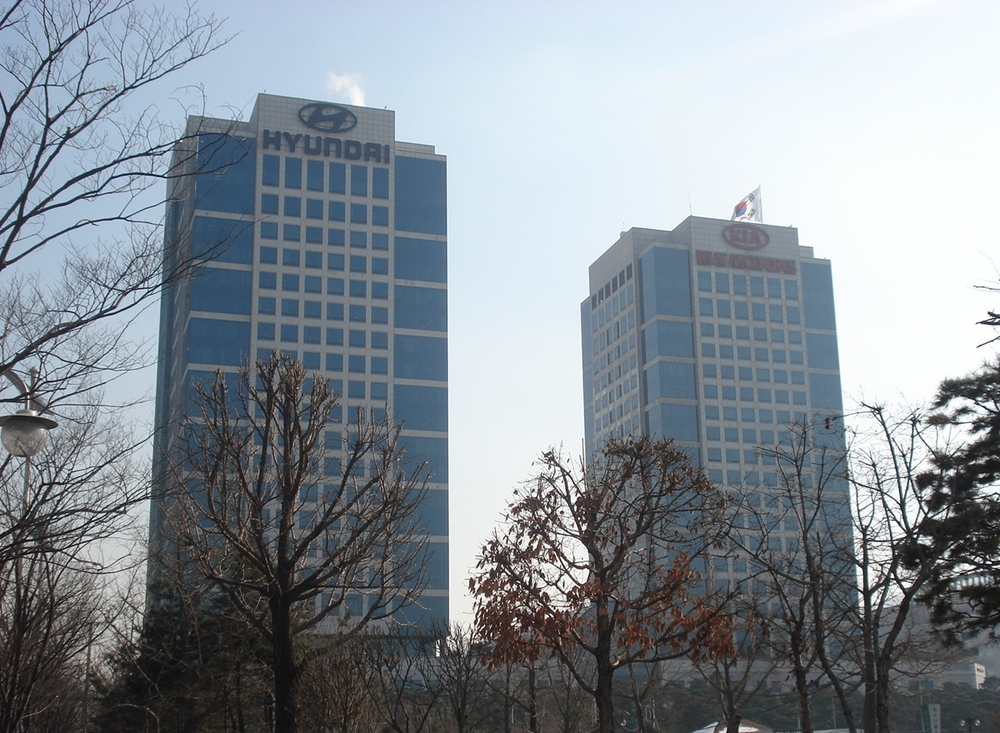

# 05 · 현대자동차그룹 통합사원증·출입통제 시스템 운영

> 에이치디에스㈜ · 2021.02 – 2024.01 · 융합전략부(2021) → SW개발팀(2022~) · 사원
> 조기취업형 계약학과로 입사해 한양대 ERICA 학업과 병행


<sub>현대자동차·기아 양재 사옥 — Photo: Chu, [Wikimedia Commons](https://commons.wikimedia.org/wiki/File:20110201_hyundai_motor_group.JPG), CC BY-SA 3.0</sub>

## 한 줄 요약

현대자동차그룹 **20개 계열사 · 175개 사업장 · 임직원 약 12만 명**이 사원증 하나로 출입·식당·통근버스를 이용하도록, 계열사 인사 데이터와 카드사·출입통제·식수 시스템을 잇는 **통합사원증 시스템**을 운영했습니다. 운영·유지보수·장애 대응이 중심이고, 일부 기능 개선과 서버 교체에 참여했습니다.

| 항목 | 내용 |
|---|---|
| 규모 | 20개 계열사 · 175개 사업장 · 임직원 약 12만 명 |
| 담당 | 수도권 사업장 (지방 사업장은 팀장 담당) |
| 스택 | MSSQL · Windows Server · VB6 · SQL Server Profiler |
| 협업 | 계열사 인사팀 · 건물 보안담당자 · 카드사 |

## 시스템 구조

```
계열사 인사 시스템 ──송수신──▶ 통합사원증 서버 (DB · 운영 / MSSQL · Windows · VB6)
                                      │  1인 1카드 권한 · 데이터 정합성
                                      ├─▶ 카드사          사원증 발급 · 재발급
                                      ├─▶ 출입통제        ACU → 카드리더 · 게이트
                                      ├─▶ 식수 관리       식당 태깅 · 정산
                                      ├─▶ 자가문진        코로나기 출근 검증
                                      └─▶ 통근버스        사원증 탑승
```

## 통합사원증 서버 교체 (2023-08, 기여도 40%)

주말 5시간 작업 시간 안에 6단계를 순서대로 점검해, 월요일 출근 전에 사원증 발급·출입 연동을 새 서버로 넘겼습니다.

1. 인사정보 · 발급이력 이관
2. 사업장 연동 중지
3. 네트워크 · DBMS 점검
4. 운영 프로그램 · 연계시스템 점검
5. 재직승인 프로그램 점검
6. 연동 재개

## 출입 데이터 시각화 (Tableau, 2023)

사옥 출입 로그를 Tableau로 집계해 건물·게이트·계열사별 출입 패턴과 시간대별 부하를 시각화했습니다. 평일 출근 시간대(07:30~08:00)에 출입이 한 구간에 크게 몰리는 것을 확인할 수 있었고, 이는 아래 3번 트러블슈팅의 근거와도 같습니다. (고객사 데이터라 대시보드 화면은 공개하지 않습니다.)

## 트러블슈팅

### 1. 로그인·출입 요청 폭주로 서비스 중단
- **원인** MSSQL·Windows 로그 분석 → 동시 인증 부하 속 DB 세션 락 누적, 비효율적인 쿼리 실행계획
- **조치** 문제 세션 긴급 분리 · 처리 우선순위 조정 → 선임과 인덱스 조정, 락 경합 테이블 분할
- **재발 방지** 재현 환경에서 검증 후 SQL Server Profiler 모니터링 · 로그 분석 자동화

### 2. 조직개편마다 출입 권한을 개발자가 수작업 수정
- **문제** 출입권한이 팀 코드에 묶여 있어 조직개편·TFT 생성 때마다 개발자에게 수정 요청이 쌓임
- **선택** 권한이 바뀌는 사정을 가장 잘 아는 건물별 보안담당자가 직접 권한을 관리하도록 구조 변경 제안·구현 참여
- **결과** 반복 요청과 개발 병목 해소

### 3. 출근 7:30–8:00, 10초 안에 게이트 통과
- **문제** 코로나기 자가문진 후 약 10초 안에 스피드게이트를 통과해야 해, 전송이 출근 시간대에 몰림
- **조치** 배치·스케줄러를 피크 시간 밖으로 재배치, 야간·주말 부하 테스트로 사전 검증

### 4. 인사 데이터 미연동으로 신규 입사자 사원증 발급 중단
- **접근** "카드 문제"가 아니라 인사 → 사원증 → 카드사로 이어지는 데이터 흐름 문제로 봄
- **조치** 데이터 동기화 과정 개선, HR 연계 데이터 재전송 절차 재정리

### 운영 원칙 — "어디서 막혔는지"를 계층별로
출입 장애는 **ACU → 카드리더 → 서버 로그** 순으로 좁혀 하드웨어·소프트웨어 원인을 분리했습니다. 퇴사 전에는 담당 사업장·서버 구성·연동 현황을 인수인계 문서로 정리했습니다.

## 회고

- **배운 것** 여러 회사가 같은 시스템을 쓰면 작은 오류도 파급이 큽니다. 추측보다 로그·데이터로 범위를 먼저 좁히고, 대응 순서는 문서로 남깁니다.
- **부족했던 것** 레거시(VB6·MSSQL) 운영이 중심이라 모던 백엔드를 직접 설계·배포해 본 경험이 부족했습니다.
- **그래서 한 일** 복무 중 실사용 서비스 백엔드(Node.js·AWS)에 참여했고, SSAFY에서 Java·알고리즘·AI를 배우며 프로젝트로 채워 가고 있습니다.

> 고객사 내부 시스템이라 화면·코드·내부 수치는 공개하지 않습니다.
